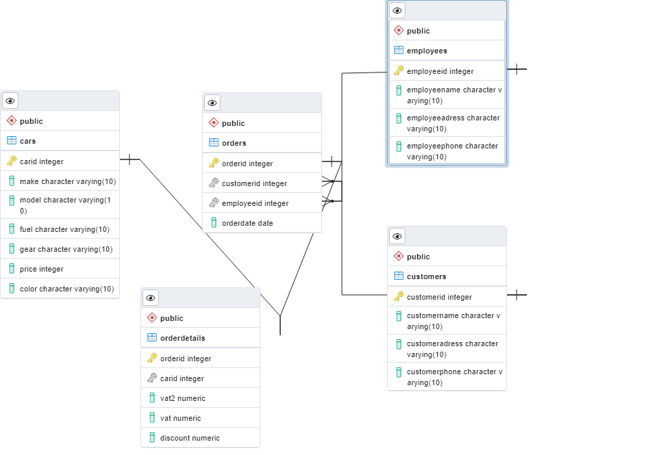

# Odev-3
## Car Dealer Database 

1. Database was created.
2. 5 Relational database object were created. Cars, Customers, Employees, Orders and Order Details. 
    - Cars, 3 different type of cars data were inserted in cars column. 
    - Customers, 3 type of customers data were inserted in customers column.
    - Employess, 3 type of employees data were inserted in employees column.
In *orders* column, customer id was relationed with customer id in *customers* column, employee id was relationed with employee id in *employees* column. In *order details* column, order id was relationed with order id in *orders* column, car id relationed with car id in *cars* column.
3. Two type of function were created, one of them returns table what is *customers_cars* and the other one returns value what is *netprice_calculator*. 
- *netprice_calculator* function get original car price (without vats), vat1, vat2 and discount. The function calculates net price of car and returns net price value.
- *customers_cars* function returns customer name, car id, car make, car model and it uses *netprice_calculator* function and also returns car net price in table.
4. Store Procedure named *add_car* was created and 3 different type of car informations were inserted with procedure. 
5. I used PostgreSql and had a hard time to generate script but I didn't. Finally I tried a different method to generate script (with Backup). I hope it works. 

